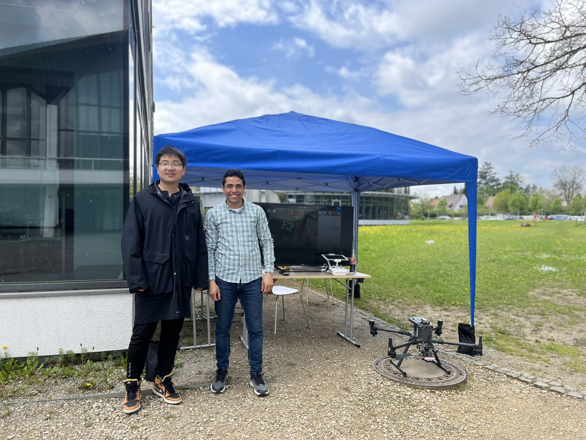
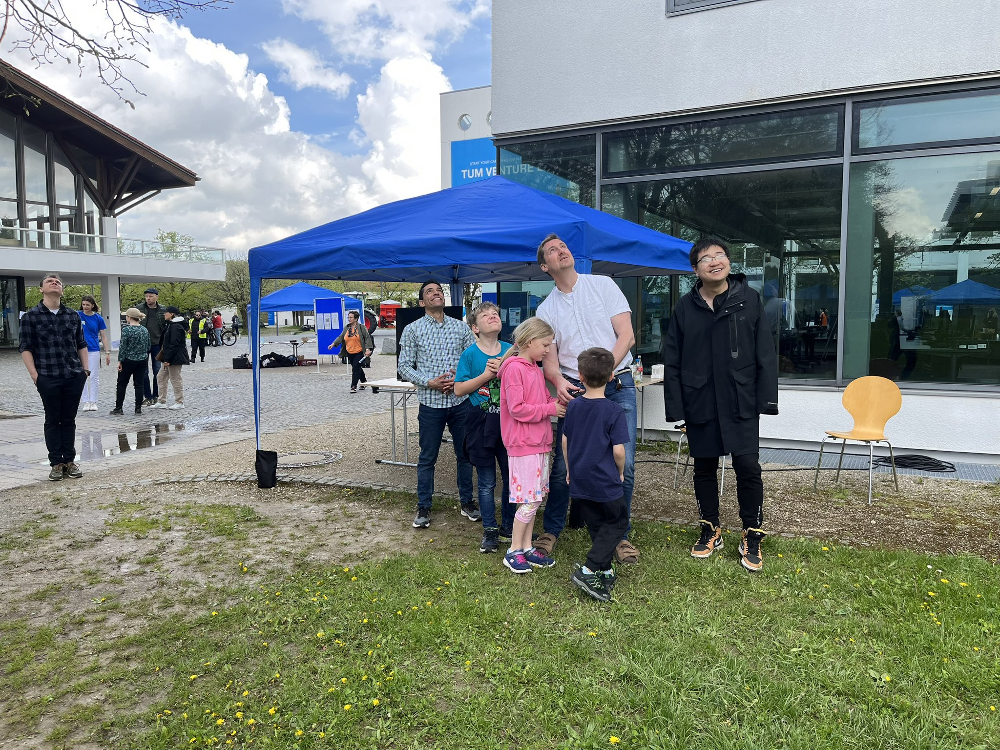

We had an amazing time showcasing our drone technology and AI-powered agricultural innovations at the FarmVision Festival 🌾 on the TUM Weihenstephan campus! 
Organized by the TUM School of Life Sciences and the Hans Eisenmann-Forum (HEF), the event brought together science, technology, and the public in a fun and interactive way.

Our team enjoyed flying demonstrations, sparking curiosity among visitors of all ages, especially the youngest future scientists! 

