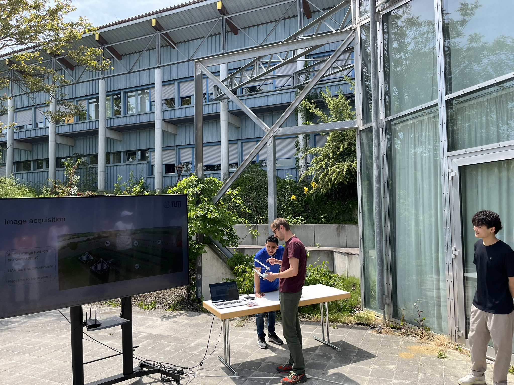
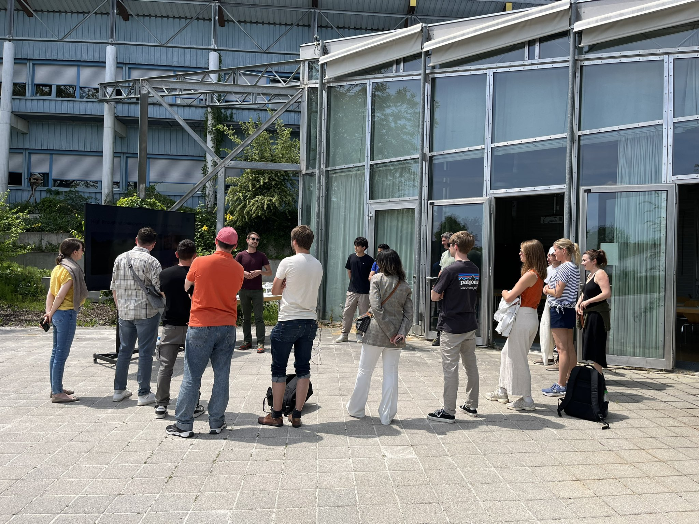

On June 1, 2023, the Precision Agriculture Lab had the pleasure of hosting a vibrant group from the TUM EIT Food Network of European agro-food start-ups at our TUM Dürnast Research Station.

Our visitors got a first-hand look at field-based crop research facilities in Dürnast. 
The highlight of the day: our drone pilots showcased their toys, demonstrating how UAV-based phenotyping supports cutting-edge agricultural research and precision agriculture.

Thanks to everyone who made the day a success show! 

#PrecisionAg #DronePhenotyping #EITFood #AgroTech #UAV4Ag #SmartFarming #TUM #CropInnovation
