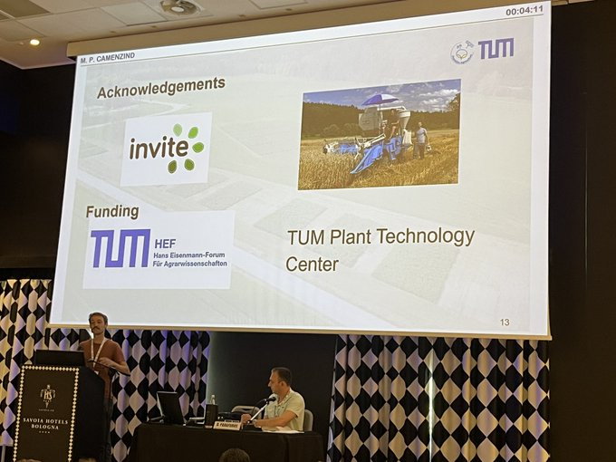
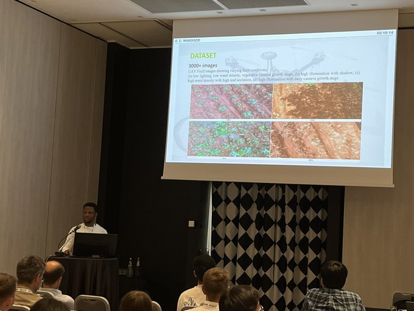
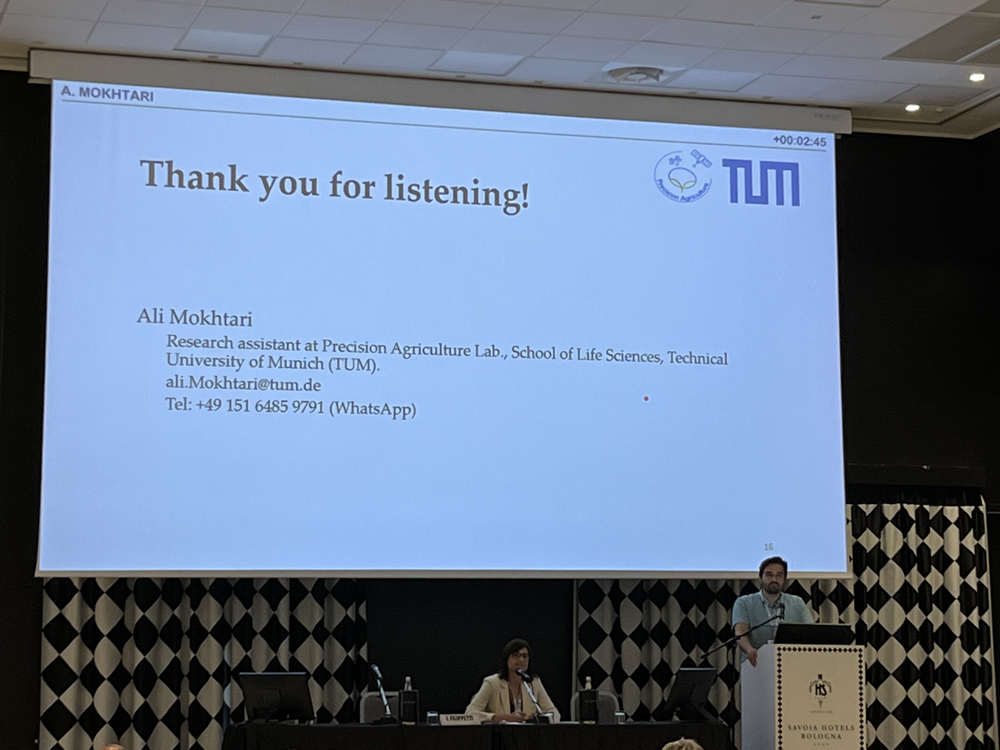
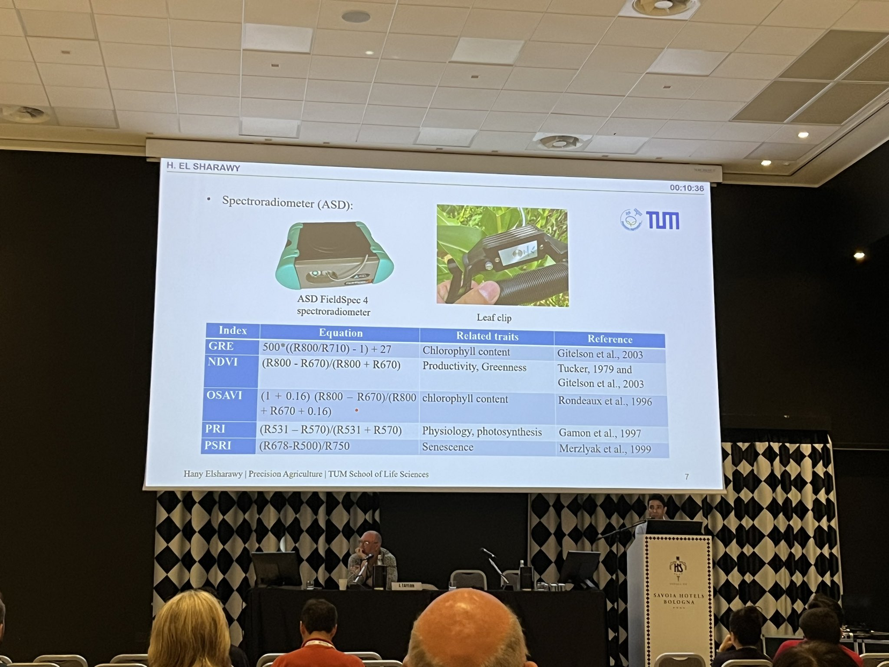

We were excited to represent PagLab at the 14th European Conference on Precision Agriculture in Bologna, Italy! 🌿📡 Our team showcased cutting-edge research on UAV-based crop monitoring, AI-driven weed detection, and satellite remote sensing applications in precision agriculture.

From insightful presentations to vibrant discussions with international researchers, the conference offered an incredible platform to exchange ideas and strengthen collaborations. 
Huge thanks to the conference organizers, and to the TUM doctoral school for supporting our Phd students.

📸 Swipe through for a quick view of lab members' talks! 

