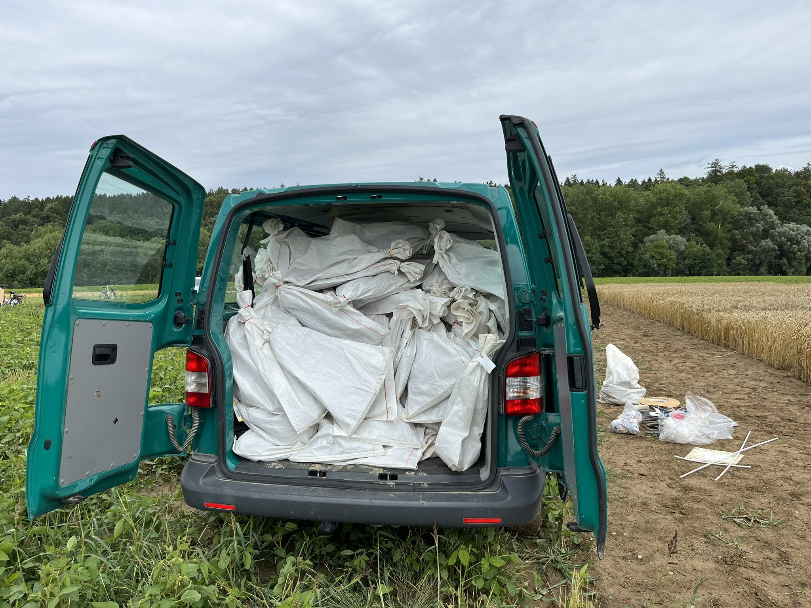

🌾 Wheat Hand Harvest Day – July 27, 2023 🌾

The Lab members rolled up their sleeves and hit the fields for a productive and memorable wheat harvest! 
With a van full of samples, muddy boots, and good spirits, the team wrapped up weeks of meticulous fieldwork.

From early morning field collection to the afternoon BBQ celebration, this day was a perfect mix of science, teamwork, and fun. 
Huge thanks to all lab members for their hard work and energy!
