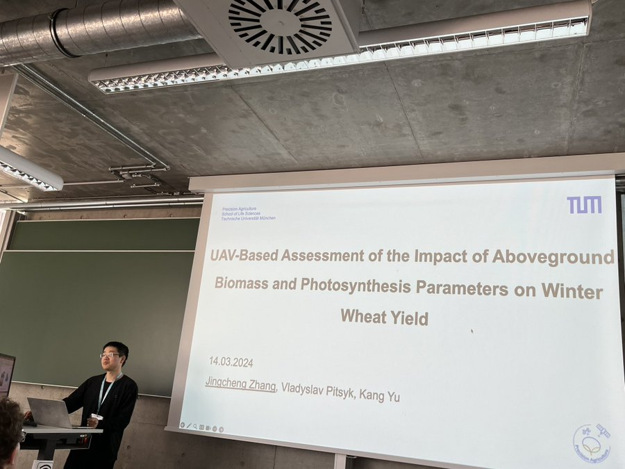

Lab members Jingcheng and Kang attended the German Society for Photogrammetry & Remote Sensing Annual Conference (#DGPF2024) in Remagen. 
Jingcheng shared some of preliminary results from our latest drone-based phenotyping work. A fantastic opportunity to connect with the DGPF community and share what we’re working on! 

It was great to see many insightful presentations and posters at the DGPF 2024 Annual Meeting in Remagen, and to see some old friends we hadn't seen in years！:)
