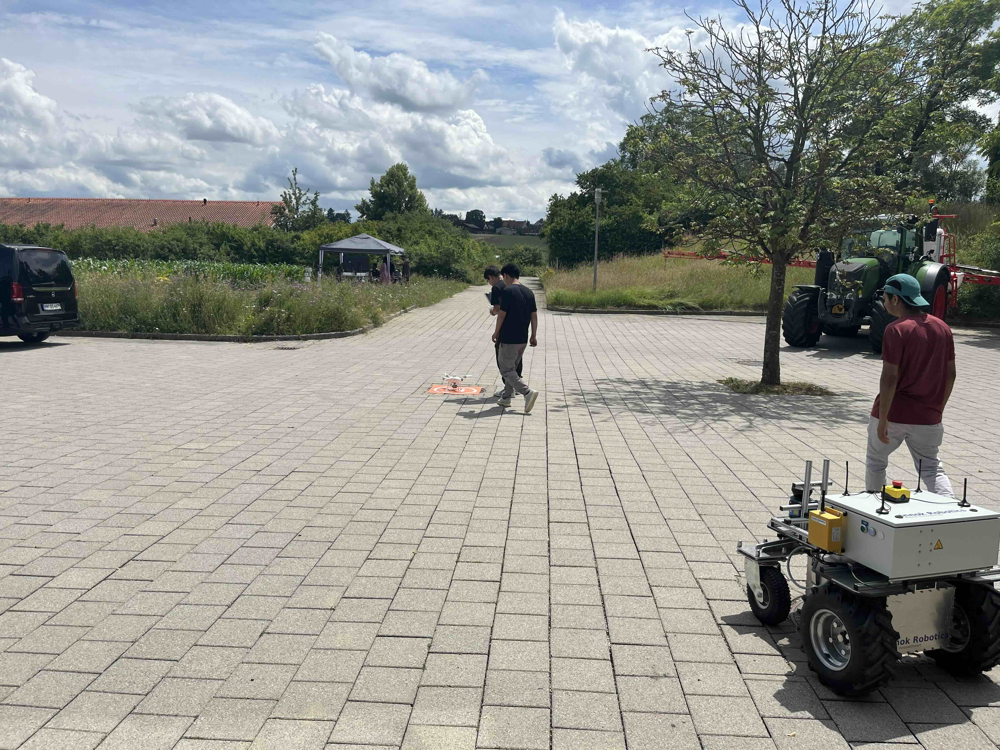
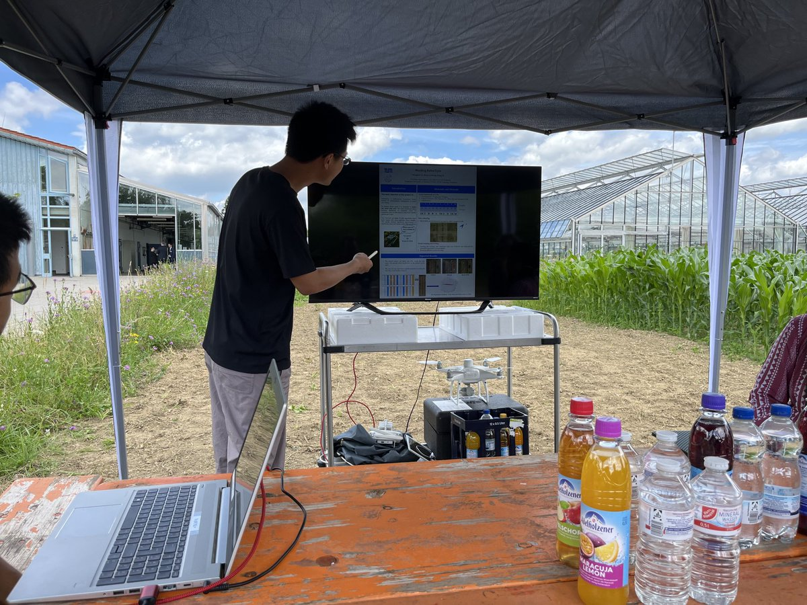
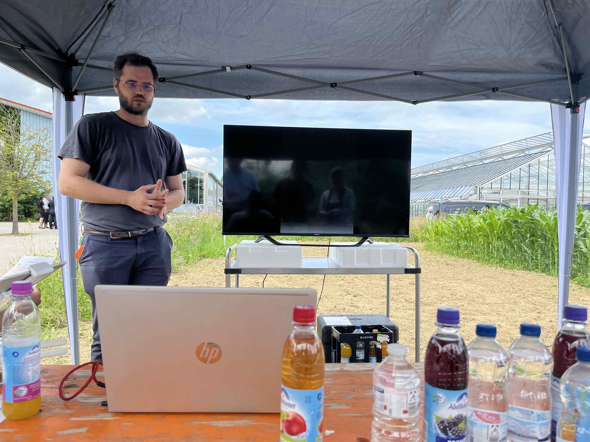

🌽🤖 AmAIzed Project – Field Meeting 🤖🌽

Today’s AmAIzed project meeting took place where it matters most—in the field! Surrounded by corn, robots, and research posters, we exchanged ideas, showcased progress, and explored innovations in AI-powered weeding.

From live drone demos and robotics tests to insightful discussions under the canopy, the day was packed with science, collaboration, and energy. 
Huge thanks to our AmAIzed project partners and students for making this outdoor project meeting a success.
 

#AmAIzed #AgRobotics #SmartFarming #AIinAgriculture #FieldResearch #PagLab #TUM #PrecisionAg
