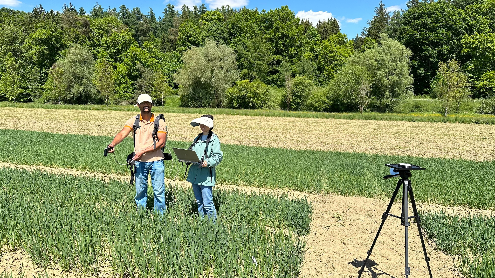

Today our group is conducting a field campaign in the INVITE wheat field trial to advance UAV-based hyperspectral remote sensing for crop trait analysis.

The drone phenotyping team (*Ying, Anirudh, Wuhua & Xiaoxin*; left to right) operated quadcopter drones equipped with hyperspectral cameras under a every ideal weather condition:).  
At the same time, in-situ hyperspectral measurements were collected using portable spectrometer for validation.  
On the ground, team members configured calibration procedures to ensured accurate georeferencing and calibration.  
This integrated setup reflects our focus on combining drone remote sensing data and ground measurements for high-resolution & hight-throughput phenotyping.

