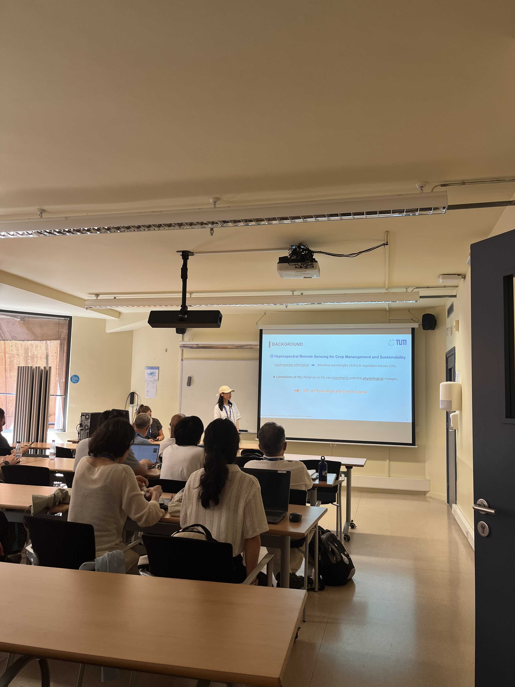

PhD student Ying Yuan from the Precision Agriculture Lab at the TUM attended the 15th European Conference on Precision Agriculture (ECPA), held in Barcelona, Spain, from June 29 to July 3, 2025. 

Ying delivered a presentation titled **"Improving Estimation of Winter Wheat Biophysical Traits Using Reflectance-Based SIF-Sensitive Indices and Multi-Task SVGP Model."** Sincere thanks to ECPA for providing this valuable opportunity to share our work and exchange with international experts!

