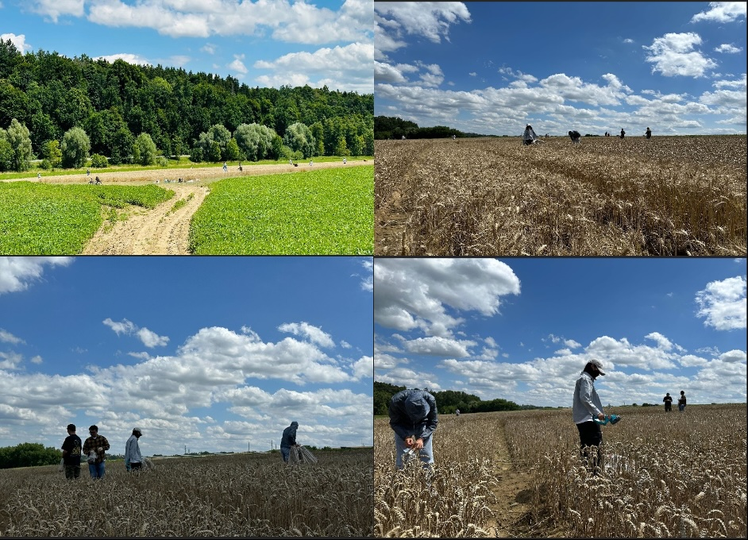
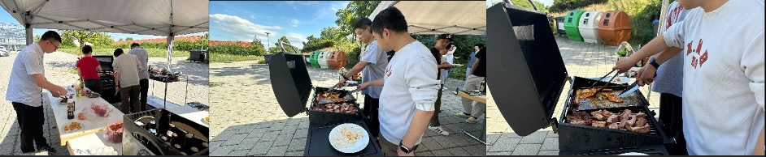

We are thrilled to share the news that the winter wheat field trial of the INVITE project has reached its harvest stage🌾 🌾 🌾 ! This marks an exciting milestone for our field phenotyping research.

The harvest took place on July 23, 2025, at the Dürnast experimental station of Technical University of Munich (TUM). It was a day of both scientific achievement and community spirit, and the Precision Agriculture Lab members enthusiastically joined the fieldwork.

Under clear summer skies, the team worked together to collect samples and document important field data, contributing to the scientifc goals of the INVITE project, which focuses on innovation in variety testing for plant breeding.

To celebrate the successful harvest, the team gathered in the afternoon for a BBQ 🔥 at the station, sharing stories 💬, laughs 😂, and delicious food 🍽🍔️. The event was not only a celebration of a season of hard work 🌾 but also a wonderful opportunity to strengthen collaboration 🤝 and enjoy the fun of science🔬.

We would like to thank everyone who contributed to this harvest, and we look forward to continuing our journey together in the INVITE crop phenotyping project! 🚁📷🚁
