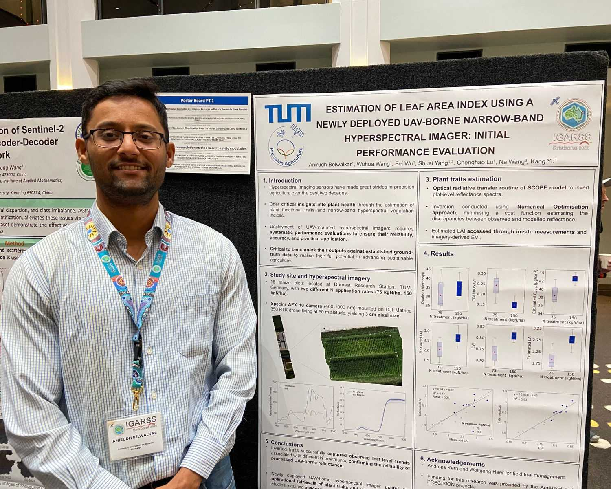
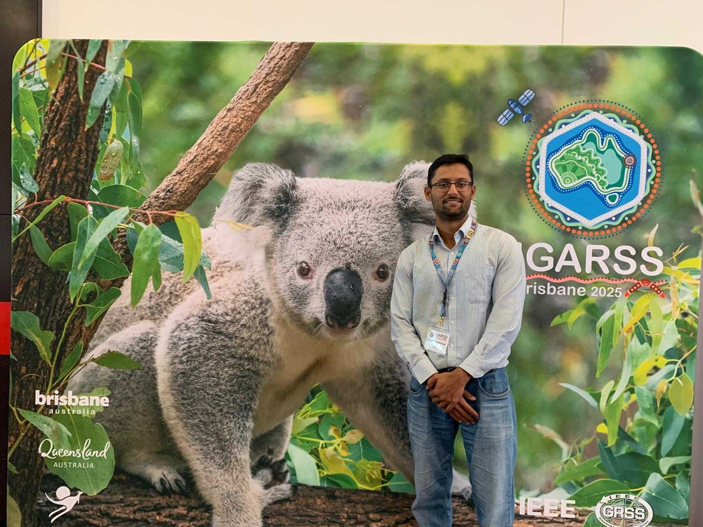

Dr. Anirudh Belwalkar, postdoctoral researcher at the Precision Agriculture Lab, TUM attended the International Geoscience and Remote Sensing Symposium (IGARSS), held in Brisbane, Australia, from August 3, 2025 to August 8, 2025.

At the conference, Dr. Belwalkar presented a poster titled “Estimation of leaf area index using a newly deployed UAV-borne narrow-band hyperspectral imager: initial performance evaluation”, showcasing the potential of our newly deployed hyperspectral imaging sensor for precision agriculture applications.

Sincere thanks to the IGARSS organizers for the opportunity to share our research and engage in meaningful discussions with international experts in remote sensing and precision agriculture.