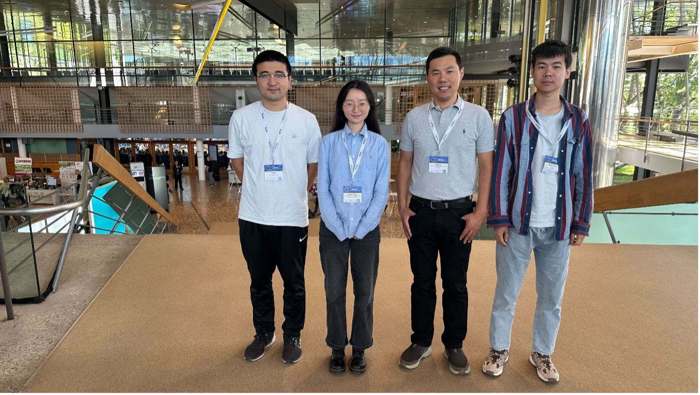
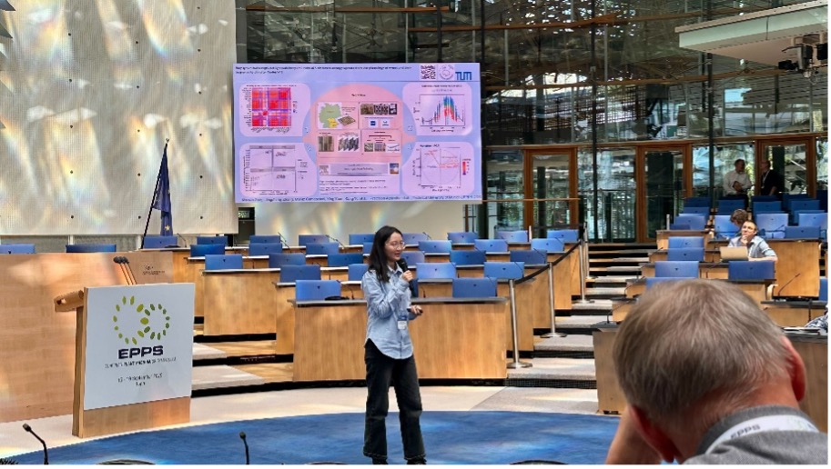
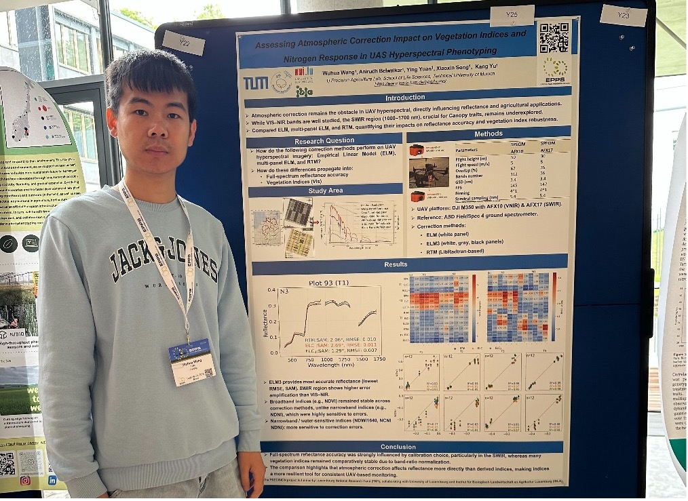
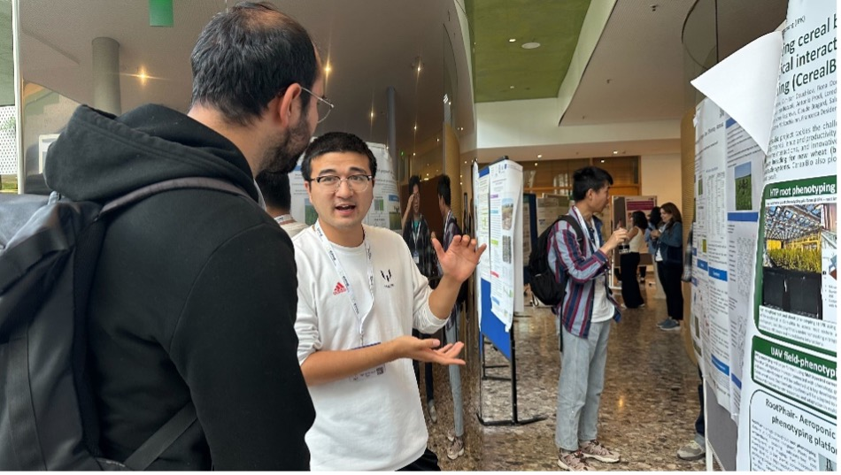

Members of the Precision Agriculture Lab at the Technical University of Munich participated in the **European Plant Phenomics Symposium (EPPS 2025)**, held in Bonn, Germany, from 16–19 September 2025.

Professor Kang Yu, together with PhD candidates Wuhua Wang, Xiaoxin Song, and Fei Wu, represented the group and shared our recent activities in UAV-based field phenotyping.

🗣️ Oral Presentation
Xiaoxin Song delivered an oral presentation titled “Stay-green traits captured by spatiotemporal traits of UAV-based canopy spectra from the phenology of wheat and their response to climate.” The presentation introduced ongoing work (2021–2025) using UAV multispectral time-series data to quantify stay-green dynamics in wheat and explore their relationship with climate variability.

📊 Poster Presentations

-	Wuhua Wang presented “Assessing Atmospheric Correction Impact on Vegetation Indices and Nitrogen Response in UAS Hyperspectral Phenotyping.” This study evaluated how different atmospheric correction methods affect spectral accuracy and vegetation index reliability—key factors for consistent nitrogen monitoring in field phenotyping. 

-	Fei Wu presented “UAV-based phenotyping of the leaf area vertical distribution of maize plants in response to nitrogen.” The research developed an approach to derive canopy-scale vertical leaf area (LA) distribution in maize using UAV imagery and a novel bell-shaped function model, providing new insights into crop architecture and nitrogen effects. 

- Kang Yu presented a poster titled “Drone-based field phenotyping for nitrogen use efficiency across wheat varieties,” showcasing how UAV multispectral imaging and machine learning can identify key phenotypic traits linked to nitrogen use efficiency (NUE) and varietal nitrogen responses in wheat.

The EPPS 2025 brought together leading experts in plant phenotyping and AI-assisted crop sciences, fostering discussions on innovative approaches to monitor and improve crop performance under changing environmental conditions.
