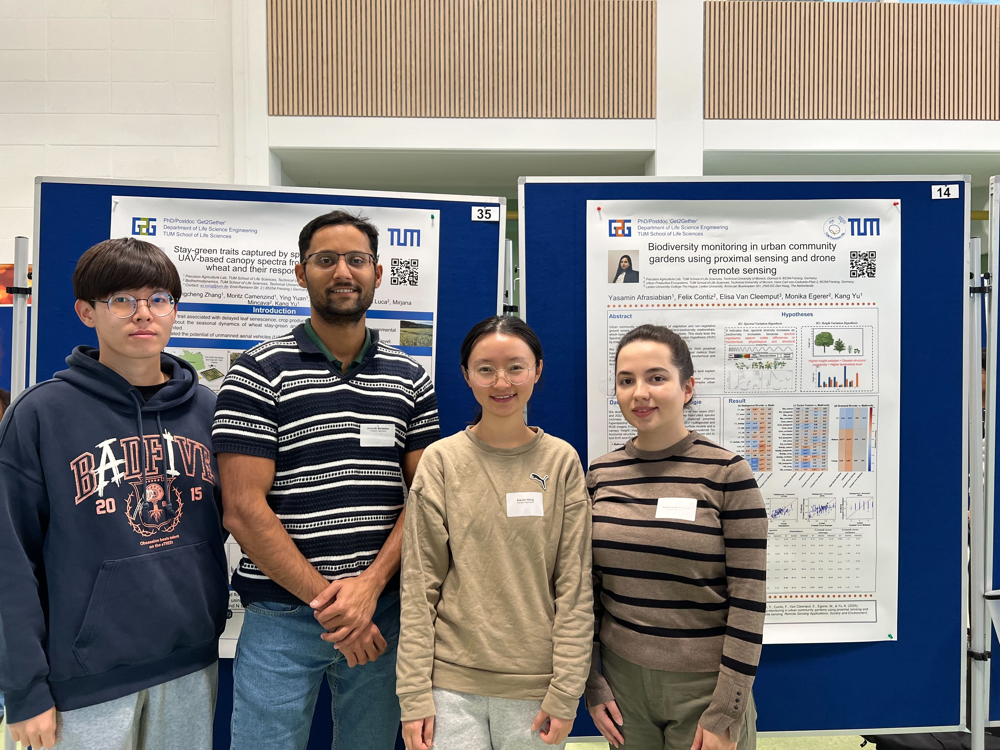
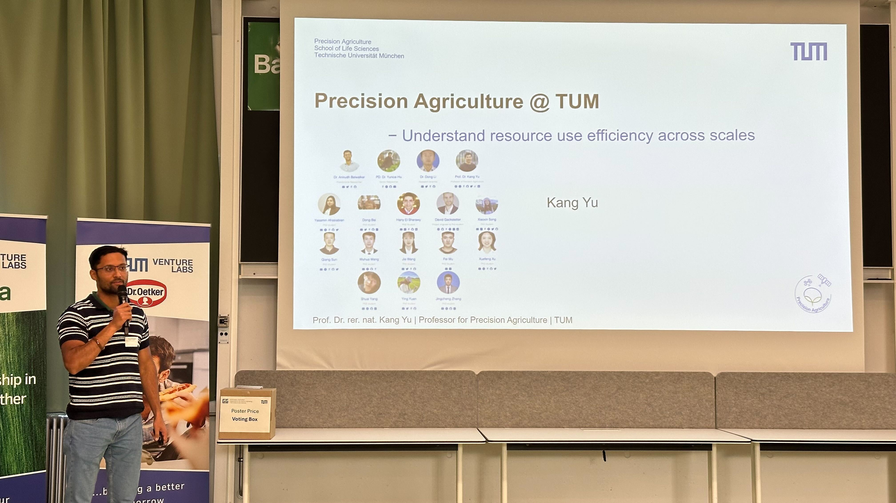

## 🌟 LSE Get2Gether 2025 — Showcasing PagLab's Research Energy!

[Get2Gether at the TUM Venture Lab Coworking Space](images/IMG_4051.jpg)
Yesterday, our department of **Life Science Engineering (LSE)** at TUM School of Life Sciences hosted the first **LSE Get2Gether** — a vibrant gathering where PhD students and postdocs from across the LSE department came together to exchange ideas, present ongoing work, and build new connections.

## 🎓 Strong PagLab Representation

We are proud that our **PagLab** was strongly represented at this inaugural event!

### 📊 Poster Presentations

Three of our talented PhD students showcased their cutting-edge research:

**[Xiaoxin Song](/author/Xiaoxin-Song)** presented work on:
- 🚁 UAV-based canopy sensing for stay-green trait analysis

**[Shuai Yang](/author/Shuai-Yang)** demonstrated advances in:
- 🧠 Deep learning methods for hyperspectral sensing of leaf nitrogen

**[Yasamin Afrasiabian](/author/Yasamin-Afrasiabian)** shared insights on:
- 🌿 Biodiversity monitoring using proximal and drone remote sensing

### 🎤 Lab Overview Presentation

Our postdoc **[Dr. Anirudh Belwalkar](/author/dr.-Anirudh-Belwalkar)** represented the lab with an engaging overview of our group's mission:

> **"Understanding resource-use efficiency across scales through sensing, modeling, and AI."**

This presentation highlighted how our diverse research projects contribute to advancing sustainable agriculture through innovative remote sensing and AI technologies.

## 💡 Building Bridges Across Disciplines

The event was a fantastic opportunity for our young researchers to:

✨ **Receive valuable feedback** from peers across different research fields  
✨ **Discuss new ideas** and potential collaborations  
✨ **Build connections** within the broader LSE community  
✨ **Present their work** to an interdisciplinary audience

## 🙏 Thank You to the Organizers

A big thank-you to the organizers at LSE for creating a warm, interdisciplinary environment that continues to support early-career scientists. Events like this are crucial for fostering collaboration and innovation within our research community.

## 🚀 Looking Forward

We look forward to the next Get2Gether day and to seeing even more breakthroughs from our team! The energy and enthusiasm displayed by our researchers yesterday is a testament to the exciting work happening in PagLab.

Congratulations to **Xiaoxin**, **Shuai**, **Yasamin**, and **Anirudh** for excellently representing our lab! 🎉

---

*The LSE Get2Gether exemplifies the collaborative spirit that drives innovation in agriculture and food research at TUM School of Life Sciences.*

#LSEGet2Gether #PrecisionAgriculture #RemoteSensing #PhDLife #TUMResearch #InterdisciplinaryScience 💡🌱🚁
