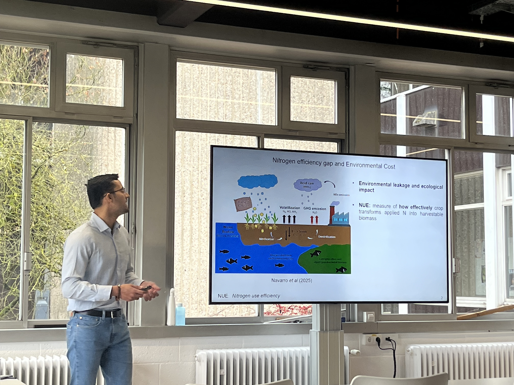
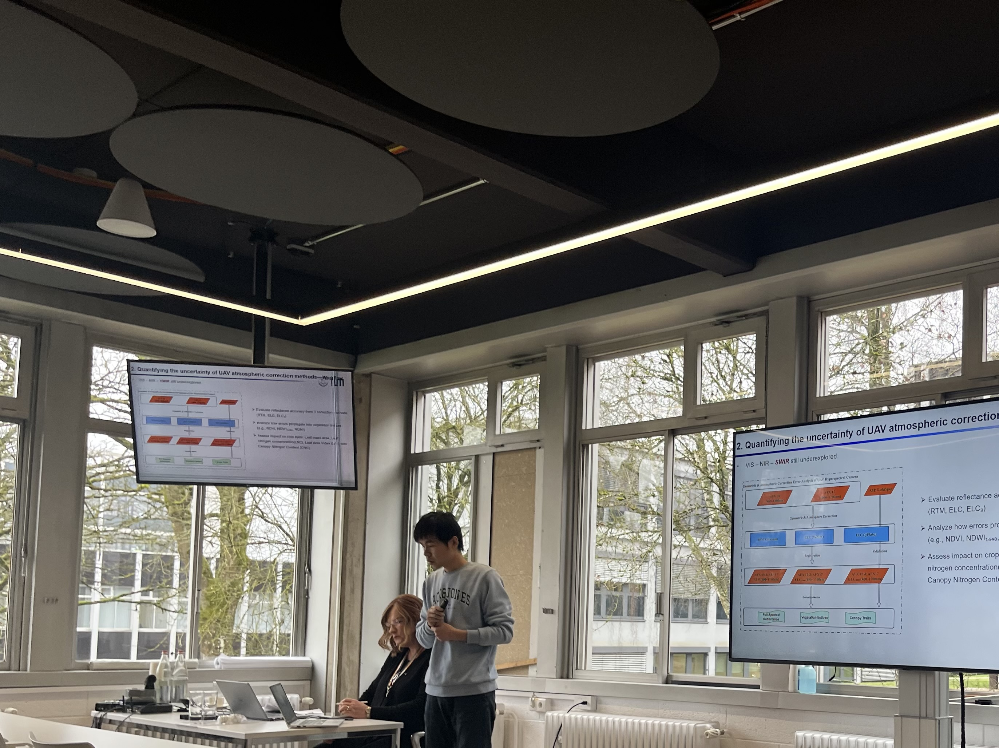

The **TUM Precision Agriculture Lab (PAG Lab)** joined the scientific workshop [**"Hyperspectral Remote Sensing and AI in Agriculture"**](https://www.uni.lu/fstm-en/events/hyperspectral-remote-sensing-and-ai-in-agriculture/) hosted by the **University of Luxembourg** (Campus Kirchberg, 4–5 February 2026). Our group delivered **three talks** connecting hyperspectral sensing, biophysical trait and SIF retrieval, and robust sensor calibration and AI pipelines for precision crop management.

## Three Talks in the Precision Crop Management Session

### Remote sensing of plant traits for nitrogen nutrition and yield estimation
[**Kang Yu**](/author/prof.-dr.-kang-yu/) gave a keynote talk and shared  our lab's work for **trait-based crop monitoring** that goes beyond generic vegetation indices—linking spectroscopy to interpretable variables relevant for **nitrogen (N) nutrition, productivity, and management**. We discussed how combining **physics-informed approaches (e.g., radiative transfer concepts)** with **machine learning** can improve generalization across environments and varieties, and help translate monitoring into practical recommendations and sensor development. 

---

### Assessing UAV-derived narrow-band SIF to characterize nitrogen use efficiency in wheat
[**Anirudh Belwalkar**'s](/author/dr.-anirudh-belwalkar/) talk focused on **narrow-band solar-induced fluorescence (SIF) from UAV platforms** and its potential to characterize **nitrogen use efficiency (NUE)** signals in wheat. The talk connected physiological interpretation (photosynthetic functioning) with operational sensing constraints, discussing when UAV SIF can add value beyond reflectance-only products for N-related monitoring.

 

---

### From reflectance to crop phenotype: quantifying uncertainty from UAV atmospheric correction methods
[**Wuhua Wang**](/author/wuhua-wang/) discussed the importance of hyperspectral data calibration and **uncertainty estimates**. This talk examined how **different UAV atmospheric correction methods** propagate uncertainty into downstream **phenotyping and trait retrieval**—a critical issue when hyperspectral workflows move from controlled experiments toward multi-site deployment.

---

## Why This Workshop Mattered for Our Lab

The Uni.lu workshop brought together experts across hyperspectral sensing, UAV platforms, AI/ML, crop health, and nutrient strategies—creating a strong space for **benchmarking methods**, discussing **data sharing and cross validation**, and aligning on what "decision-ready" remote sensing should look like. For our PAG Lab, it was especially valuable to exchange views on **Bridging physics + AI** for stronger transferability (across years, sites, genotypes). 

## Thanks & Next Steps

We thank the **University of Luxembourg**, Prof. Teferle's team and the workshop organisers for hosting a focused, high-quality event. 

If you are interested in collaboration on **hyperspectral trait retrieval**, **UAV SIF**, or **nitrogen decision support**, feel free to reach out—we are keen to build shared datasets, benchmarks, and reproducible workflows.
*— TUM Precision Agriculture Lab *
