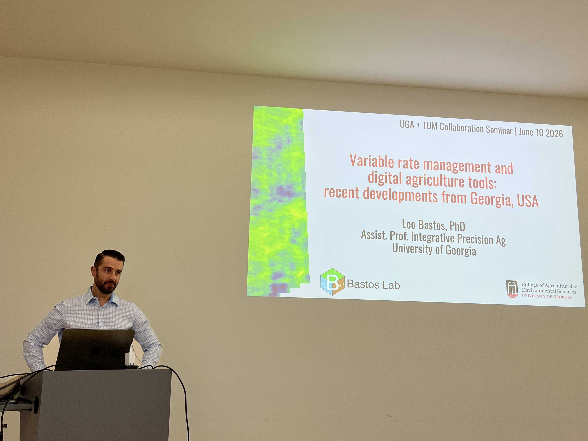
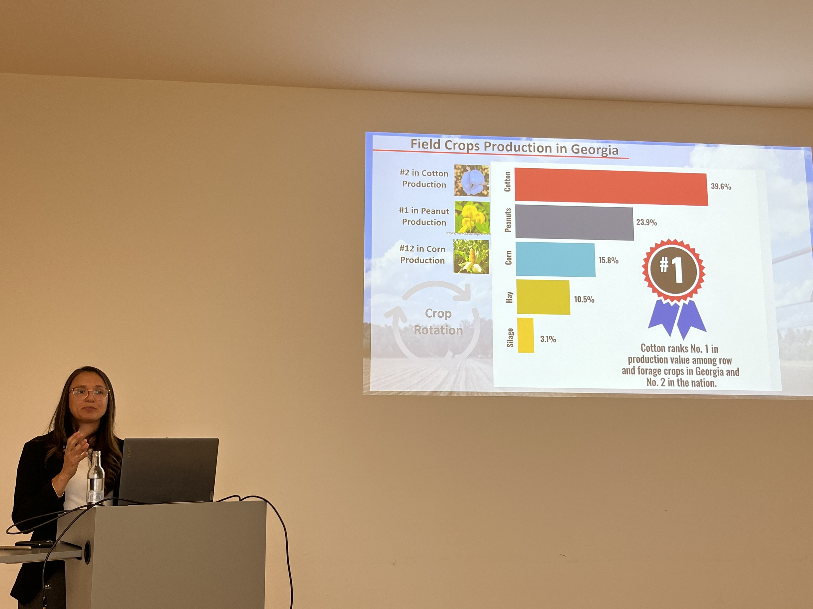
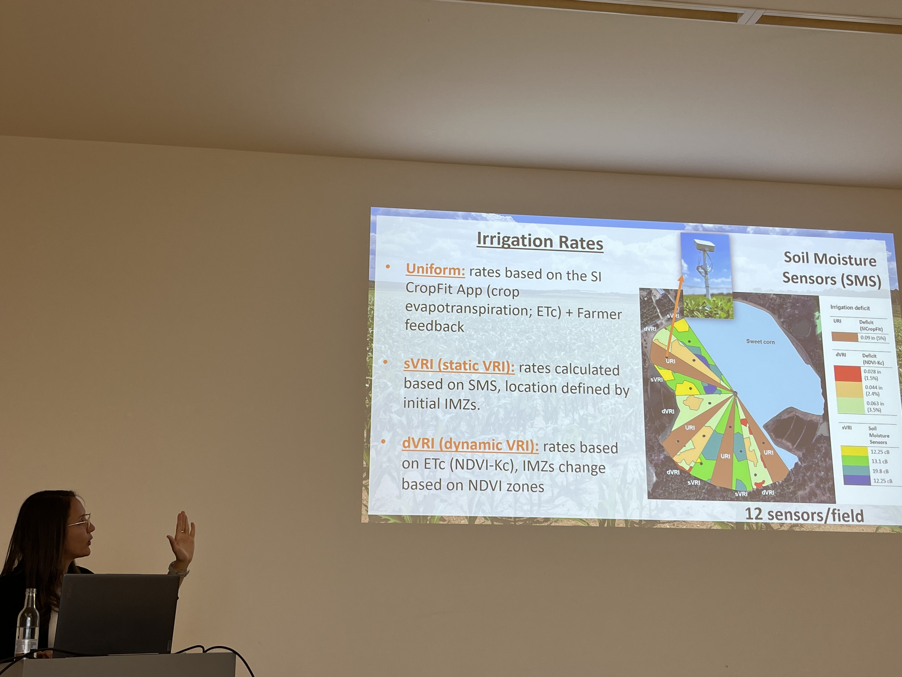
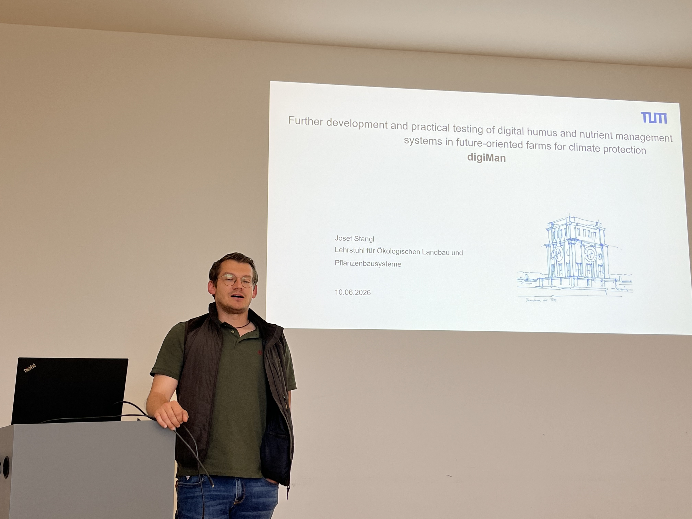
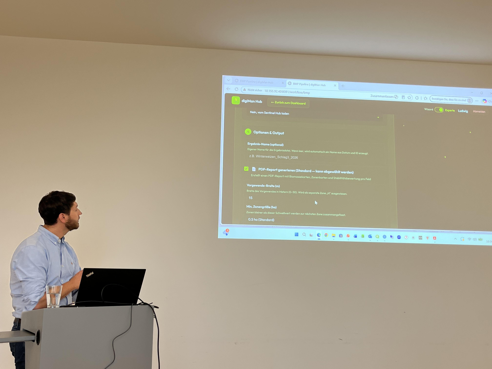
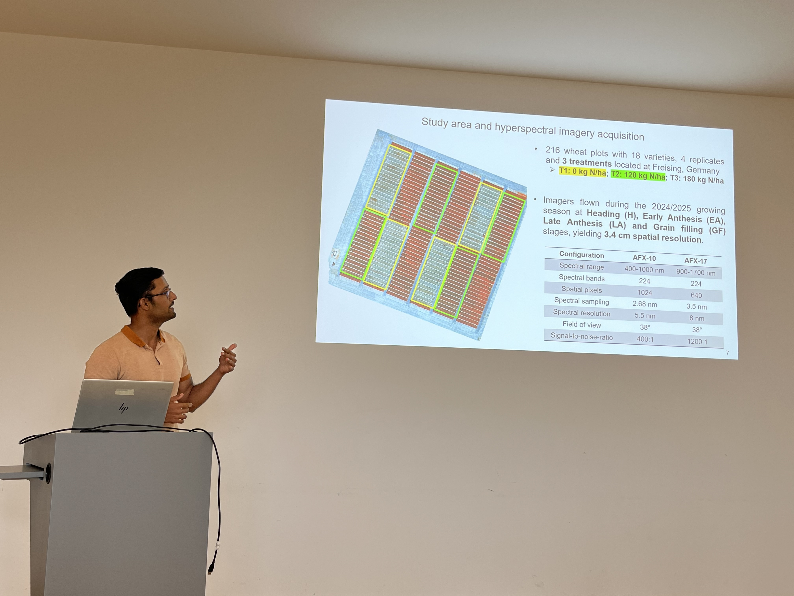
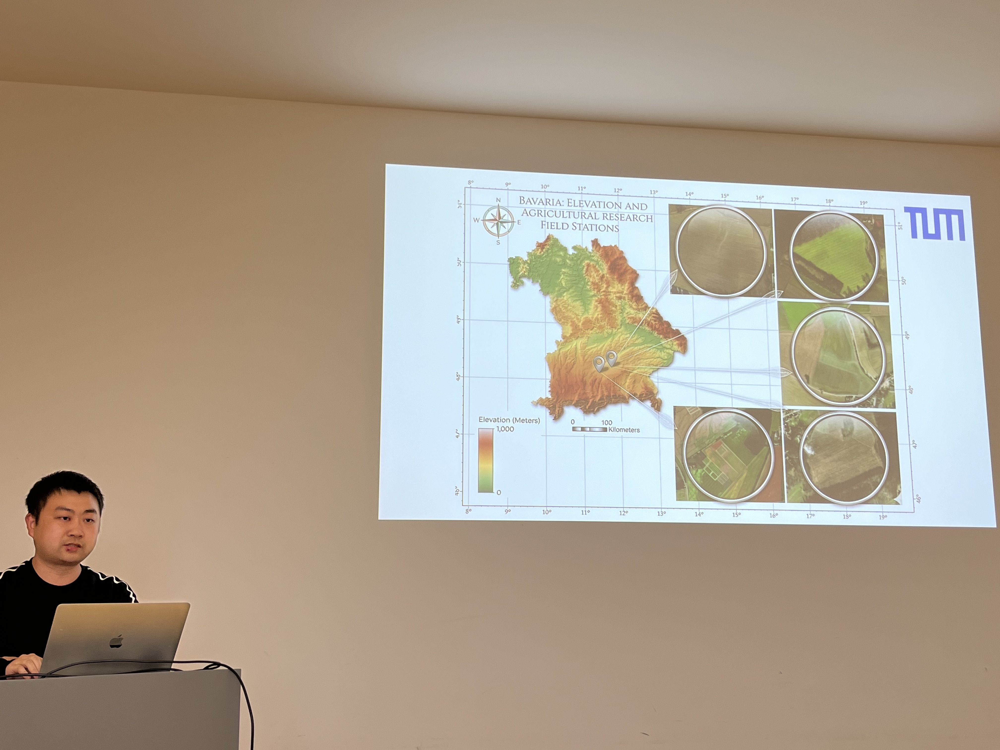

On **10 June 2026**, the **TUM Precision Agriculture Lab (PAG Lab)** together with **Chair of Organic Agriculture** hosted a full-day **joint seminar with the University of Georgia (UGA, Athens, USA)** at the Weihenstephan campus. Colleagues from UGA and TUM spent the day exchanging recent work spanning variable-rate management, precision irrigation, satellite and UAV remote sensing, field phenotyping, smart farming apps, and digital nutrient management — a broad sweep across two continents and several cropping systems.

The seminar was held under the framework of [**GlobalNitroLink**](/project/globalnitrolink/), a TUM–UGA international exchange project funded through the **BayIntAn** programme of the **Bavarian Research Alliance (BayFOR)**, which supports new research partnerships between Bavarian universities and leading international institutions.

## Recent Developments from Georgia

The morning opened with two talks from our UGA guests.

**Dr. Leo Bastos**, a Professor in Integrative Precision Agriculture at UGA, presented **"Variable rate management and digital agriculture tools: recent developments from Georgia, USA."** His group works at the intersection of proximal and remote sensing, geospatial soils, and temporal weather data to inform crop management from within-field to regional scales, with a particular focus on **nitrogen fertilizer management and crop quality mapping**.

**Dr. Lorena Lacerda**, a Professor in Integrative Precision Agriculture at UGA, followed with a tour of the **Georgia production environment and precision irrigation**. Starting from Georgia's field-crop landscape, the talk moved into **variable-rate irrigation (VRI)** with center-pivot systems: soil-moisture-sensor networks, static and dynamic VRI strategies, zone- and nozzle-level control. Her broader interest lies in **UAV and satellite remote sensing** to capture soil–plant–environment interactions and their spatial and temporal variability.

## Precision Sensing at TUM

In the late morning, colleagues from the **TUM Chair of Organic Farming ** presented the **digiMan** project — *"Further development and practical testing of digital humus and nutrient management systems in future-oriented farms for climate protection."* **Josef Stangl** and **Ludwig Hagn** walked through the project's goals and its digiMan Hub, which turns field data into zone-based nutrient management recommendations, linking soil carbon and nutrient management to climate protection on working farms.

## Digital Nutrient Management for Climate-Friendly Farming

In the afternoon, members of the **TUM Precision Agriculture Lab** — including [**Anirudh Belwalkar**](/author/dr.-anirudh-belwalkar/) and [**Dong Bai**](/author/dong-bai/) — shared current work on **UAV- and sensor-based crop monitoring**. Talks covered **hyperspectral imaging of wheat nitrogen experiments** at our Dürnast and Roggenstein sites — hundreds of plots across varieties and N treatments imaged through key growth stages at centimetre-scale resolution — and the network of **agricultural research field stations across Bavaria** that anchors our field campaigns.

## Connections and Next Steps

The seminar fit naturally into a growing **transatlantic network** in integrative precision and digital agriculture. Just last month, TUM alumnus **Prof. Christian Bredemeier (UFRGS, Brazil)** — who previously hosted Dr. Bastos as a visiting professor — gave a guest lecture at Weihenstephan, and Dr. Bastos himself joined our **BIGSTAR workshop** at TUM in November 2025. These overlapping circles between **Athens (GA), Weihenstephan, and Porto Alegre** make joint research on sensor-based nitrogen and water management, variable-rate technologies, and UAV phenotyping — together with student exchange — natural next steps.

The exchange continues straight away: as the reciprocal leg of the **GlobalNitroLink** collaboration, the **TUM team will visit the University of Georgia in July 2026** to continue the conversations started in Weihenstephan and to plan the next steps together on the ground in Athens.

## Thanks

Thank you to our colleagues from the **University of Georgia** for two excellent talks, to TUM colleagues for joining the day and helpign organize and present. We look forward to building on these connections.

*— TUM Precision Agriculture Lab*
