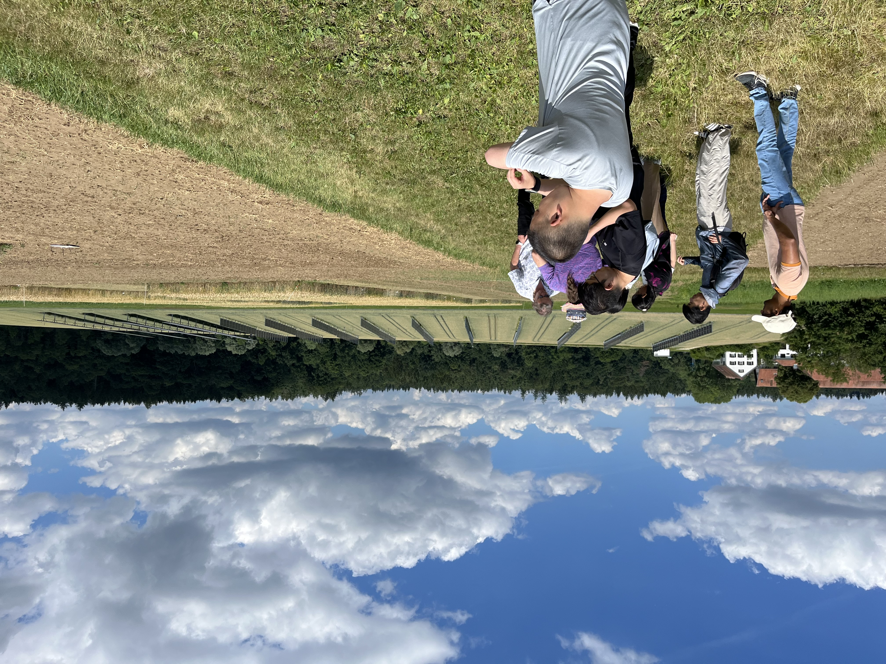
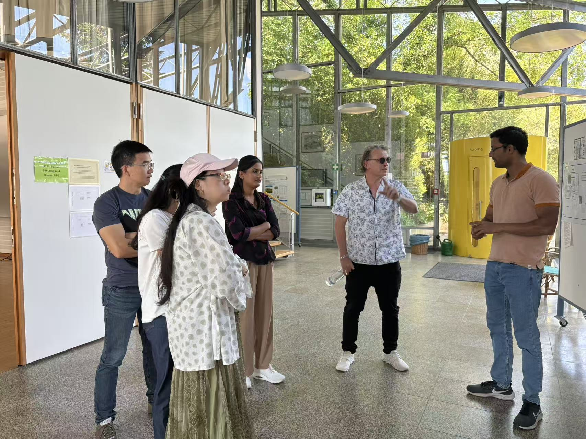
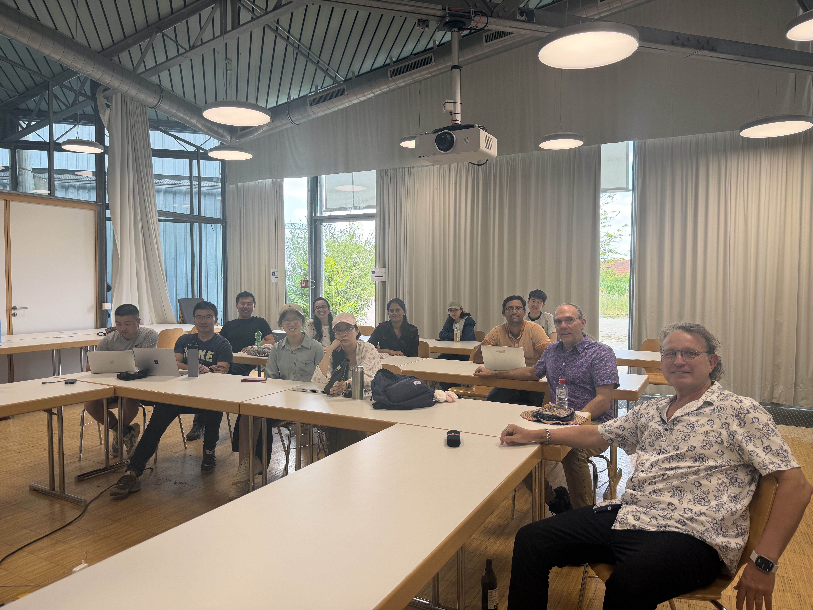
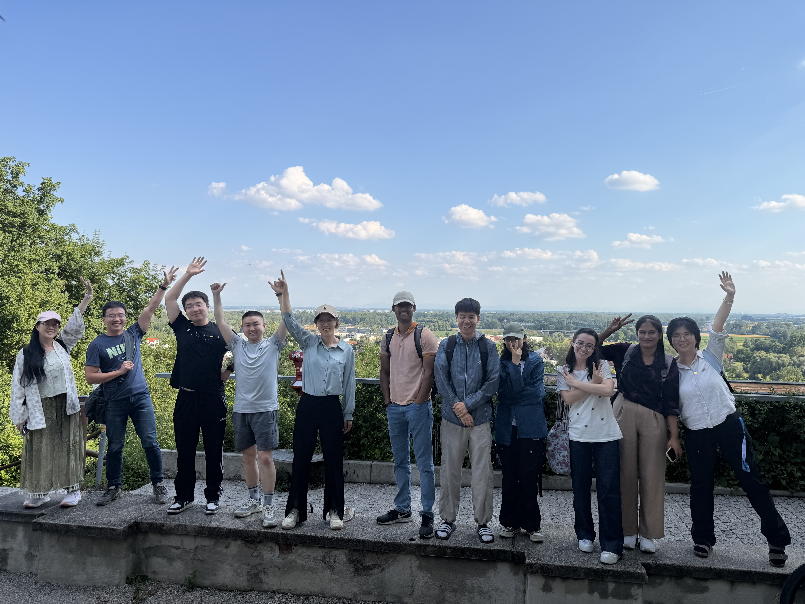

On **2 July 2026**, the **TUM Precision Agriculture Lab (PAG Lab)** welcomed a delegation from the **University of Queensland (UQ), Australia** to the **Dürnast Research Station**. The visitors — including **Prof. Andries Potgieter** and **Prof. Scott Chapman** — came to see our wheat field phenotyping experiments first-hand and to exchange ideas on how remote sensing can strengthen crop monitoring, modelling, and nitrogen management across very different production environments.

## Touring the Wheat Phenotyping Trials

The day started in the field, where the delegation walked our ongoing **wheat phenotyping trials** at Dürnast. We discussed the experimental design, the varieties and traits being tracked through the season, and how UAV- and sensor-based measurements are being used to capture canopy development, nitrogen status, and various ground and lab measurements across the plots.

## Introducing Our Research Through Posters

Back at the station, PAG Lab members introduced our projects to the delegation through some **research posters**. The posters gave the visitors a quick overview of the group's activities and sparked lively conversations about methods, sensors, and results.

## Remote Sensing for Crop Monitoring and Modelling

A central theme of the visit was the role of **remote sensing in crop monitoring and modelling**. The conversation ranged from UAV and satellite data for in-season crop status, to how such observations can be linked with crop growth and yield models. With the UQ team's strong background in agroclimatology, phenomics, and crop modelling, and the PAG Lab's focus on UAV-based and hyperspectral phenotyping, the discussion highlighted the complementarities between the two groups.

## Field Protocols for Agricultural Remote Sensing

The delegation and the PrecisionAg Lab team also compared notes on **field protocols for agricultural remote sensing** — from ground reference and calibration practices to flight planning, timing, and data quality — with the aim of making measurements more consistent and comparable across sites and platforms. Aligning such protocols is an important step toward jointly usable datasets and reproducible analyses.

## Connections and Next Steps

The visit reinforced growing ties between the TUM PrecisionAg Lab and the UQ Crop phenotyping and modelling experts. Shared interests in UAV and satellite phenotyping, crop modelling, and standardized field protocols make joint research, data sharing, and student exchange promising next steps.

## Thanks

Many thanks to **Prof. Andries Potgieter** for organizing and the wider **University of Queensland** delegation for visiting Dürnast, and to everyone in the PAG Lab who helped host the field tour and discussions.

*— TUM Precision Agriculture Lab*
