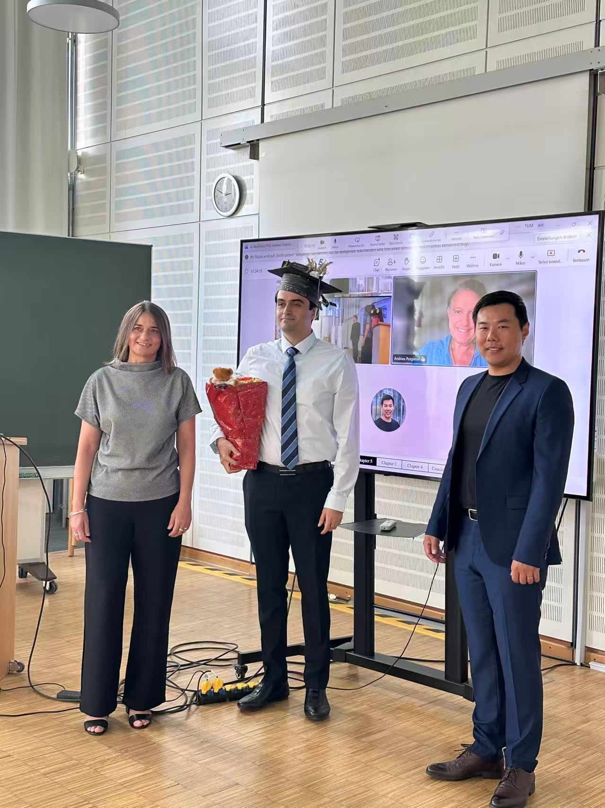
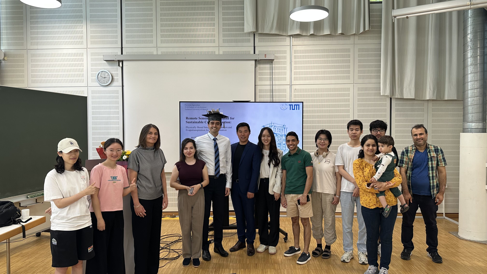
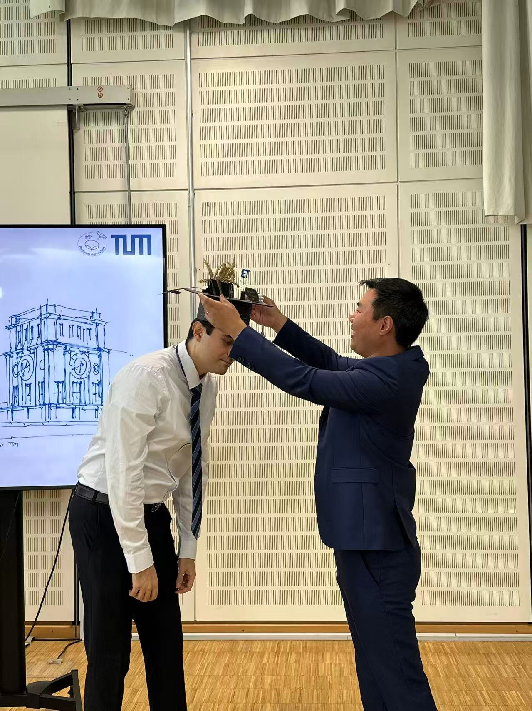

Congratulations to **[Ali Mokhtari](/author/ali-mokhtari/)**, who has just completed his PhD in our **Precision Agriculture Lab at the Technical University of Munich**. Over five years, Ali pursued a deceptively simple question: can satellites tell whether crop water and nitrogen availability limit crop growth in a wheat field?

It is a question that matters. We need to grow more food without using more water and fertilizer, and satellites pass over every field every few days. But they have blind spots, and Ali set out to close them by combining physics and plant physiology rather than relying on a black box.

---

## 🌾 A field's thirst and hunger, read from space

His work delivered a set of well-connected technical advances:

- He found a way to **estimate crop water use from optical satellites** such as Sentinel-2, without the thermal data that most methods depend on — an approach now being used and extended by other groups worldwide.
- He built a model that **combines a crop's water status and its chlorophyll to predict wheat yield** better than either signal alone, outperforming classical methods based on vegetation indices.
- He designed a **new concept for predicting plant nitrogen** and derived an elegant equation linking **soil moisture to evaporation**.

What holds it all together is a philosophy: build tools that are **physically grounded, interpretable, and transferable**. In doing so, Ali's work bridges satellite remote sensing, soil physics, and crop physiology for precision crop monitoring.

---

## 🌟 Congratulations, Dr. Ali Mokhtari!

We are proud of what he achieved — several results appear in leading journals. In the spirit of good scientific work, this is a solid step forward in understanding the nexus of water and nitrogen resources in agriculture, not a finish line. We congratulate him warmly and look forward to the impact of his future work.

Most of all, we are proud of the independent scientist Ali has become.

A warm thanks to our team members for their creativity in preparing Ali's doctoral hat — a cherished tradition that made the celebration joyful and memorable.

Congratulations, Ali!

---

## 🌟 Thanks

We would like to thank the examination committee and the thesis advisory committee for their time, guidance, and rigorous engagement with his work. My sincere thanks go to **Prof. Mirjana Minceva** for chairing the defense and to **Prof. Andries Potgieter (UQ)** as co-examiner. 

I am also grateful to Ali's thesis advisory committee — **Dr. Morteza Sadeghi** as the candidate's mentor and **Dr. Holly Croft** as the external co-supervisor — whose input helped shape this research over the years.

Most of all, thank you, Ali, for your dedication and your many contributions to the Precision Agriculture Lab over the past five years. We wish you all the best in the next chapter.

---

*This achievement exemplifies the excellence in research and collaborative spirit that defines our Precision Agriculture Lab at TUM Family.*

#PhDDefense #RemoteSensing #Evapotranspiration #CropWaterStatus #Nitrogen #PrecisionAgriculture #TUM
