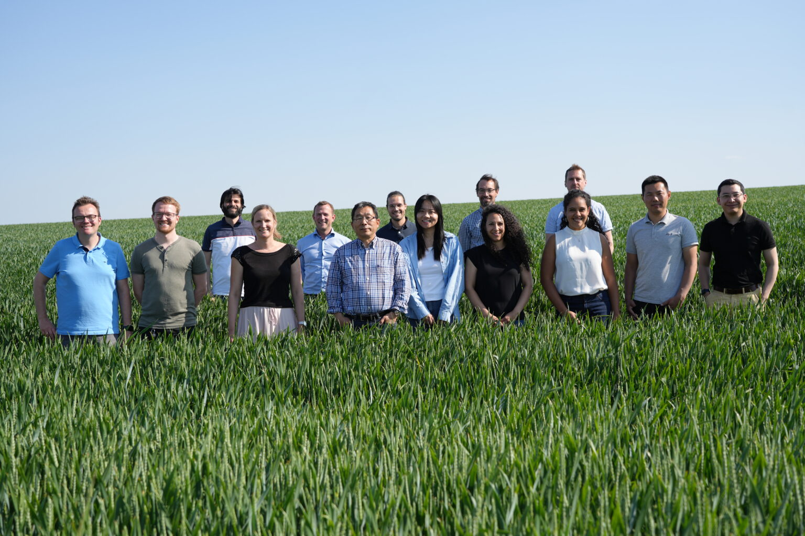

## Overview

**LiveSen-MAP** is an EU-funded project aiming to revolutionize fertilizer application in agriculture. 
By combining innovative biosensor test strips with satellite-based remote sensing data, the project seeks to provide real-time, field-specific fertilizer recommendations, enhancing crop yields while minimizing environmental impact.

## Objectives

- **Develop advanced biosensors**: Create test strips capable of accurately measuring nitrate levels in plant sap directly in the field.
- **Integrate remote sensing data**: Utilize satellite imagery to assess field variability and crop health indicators.
- **Implement AI-driven models**: Develop predictive algorithms that combine sensor and satellite data to generate precise fertilization recommendations.
- **Promote sustainable agriculture**: Reduce over-fertilization, decrease greenhouse gas emissions, and prevent nutrient runoff into water bodies.

## Collaboration and Funding

- **Lead Institution**: Technical University of Munich (TUM)
- **Funding**: European Innovation Council (EIC) under Horizon Europe
- **Project Duration**: June 2023 – May 2026
- **Collaborators**: Interdisciplinary team including experts in precision agriculture, chemistry, computer science, and innovation management.

For more information, visit the [LiveSen-MAP project page](https://www.livesen-map.eu/en/).